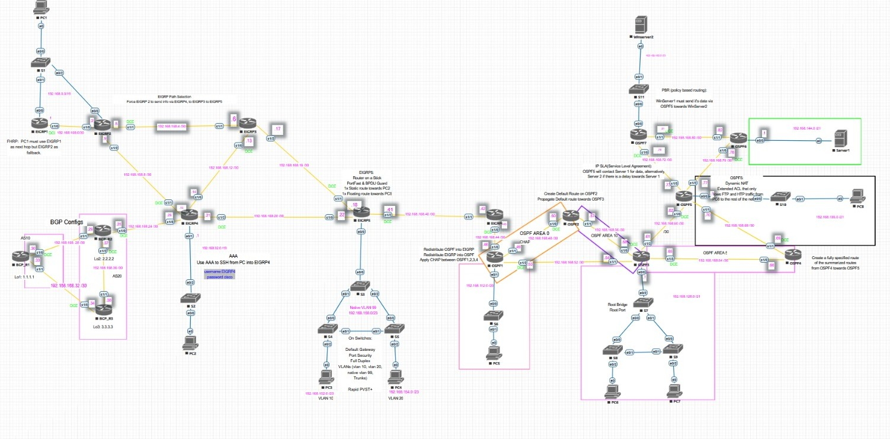

# Advanced Network Design Project

## 📚Project Overview
This repository contains a comprehensive network simulation designed to synthesize advanced routing, switching, and security protocols. The project was built over a 20-week timeline, moving from basic addressing to complex multi-protocol redistribution and traffic engineering.

* **Platform:** EVE-NG
* **Topology:** [Topology_Diagram.png](./Topology.jpeg)
* **IP Planning:** [VLSM.xlsx](./VLSM.xlsx)

## Network Topology

## 📋Key Configurations & Deliverables
Based on the project roadmap, the following technologies were implemented and verified:

### 1. Routing & Path Control
* **OSPF & EIGRP Redistribution:** Configured mutual redistribution between OSPF and EIGRP (AS 2, 3, 4) with careful metric manipulation.
* **BGP:** Implemented eBGP peering and attribute configuration.
* **Policy Based Routing (PBR):** Applied traffic policies on OSPF6 to manipulate routing paths.
* **Path Selection:** Tuned EIGRP metrics and OSPF costs for primary/secondary path preference.

### 2. High Availability & Redundancy
* **FHRP:** Configured First Hop Redundancy Protocols (HSRP) on EIGRP1 for gateway redundancy.
* **IP SLA:** Implemented IP Service Level Agreements to track routes and automate failover.
* **Spanning Tree (STP):** Configured Rapid PVST+, manually setting Root Bridges and Root Ports (Switch 7) to align with Layer 3 paths.

### 3. Security & Access Control
* **Layer 2 Security:** Implemented Port Security (Sticky MAC), VLAN segmentation, and prevented switching loops.
* **Authentication:** Applied CHAP authentication between OSPF areas.
* **ACLs:** Configured Extended Access Control Lists (ACLs) for granular traffic filtering.
* **AAA & SSH:** Hardened device access with AAA authentication and secure shell.

### 4. Services & addressing
* **VLSM:** Designed a scalable addressing scheme using Variable Length Subnet Masking.
* **NAT:** Configured Dynamic NAT to allow internal hosts external connectivity.

## 🚀How to Run This Lab
1. Download `Advanced Network Infrastructre Project.unl` from the file list above.
2. Import the file into your EVE-NG environment.
3. Ensure you have the necessary Cisco IOS images installed.
